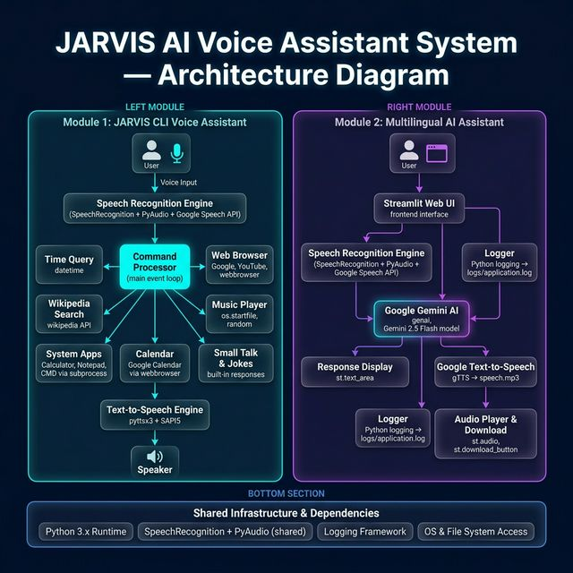

# JARVIS AI Voice Assistant System

**Author:** Deepak Manola

A voice-controlled personal assistant in Python, inspired by JARVIS from Iron Man. The project has two independent modules:

1. **JARVIS CLI Voice Assistant** — listens to spoken commands in the terminal and opens apps, plays music, searches Wikipedia, tells jokes and more.
2. **Multilingual AI Assistant** — a Streamlit web app that sends your spoken question to Google Gemini and replies in text and audio.



---

## Features

### Module 1 — JARVIS CLI (`main.py`)

| Say something with… | JARVIS will… |
|---|---|
| `time` | Tell the current time |
| `name` / `how are you` / `who made you` / `thank you` | Small talk |
| `music` | Play a random song from `music/` |
| `open calculator` / `open notepad` / `open cmd` | Launch the Windows app |
| `open google` / `open facebook` / `open calendar` | Open the site in your browser |
| `youtube <search>` | Search YouTube |
| `wikipedia <topic>` | Read a 2-sentence Wikipedia summary |
| `joke` | Tell a programming joke |
| `exit` | Say goodbye and quit |

### Module 2 — Multilingual AI Assistant (`Multilingual AI Assistant/main.py`)

- Voice input through the microphone
- Answers generated by **Google Gemini 2.5 Flash**
- Response shown as text and played as audio (gTTS)
- Download the spoken answer as an MP3

---

## Tech Stack

| Purpose | Library |
|---|---|
| Speech-to-text | SpeechRecognition, PyAudio |
| Text-to-speech | pyttsx3 (SAPI5, offline), gTTS (online) |
| AI | Google Gemini |
| Web UI | Streamlit |
| Knowledge | wikipedia |
| System control | subprocess, os, webbrowser |
| Logging | logging → `logs/application.log` |

---

## Requirements

- **Windows 10/11** (Module 1 uses the Windows SAPI5 voice engine)
- **Python 3.8+** (tested on 3.12)
- A microphone and speakers
- Internet connection (Google speech recognition, Wikipedia, Gemini, gTTS)
- A **Google Gemini API key** for Module 2 — get one free at [Google AI Studio](https://aistudio.google.com/apikey)

---

## Installation

```powershell
# 1. Clone the repo
git clone https://github.com/manola1109/Jarvis-System.git
cd Jarvis-System

# 2. Create and activate a virtual environment
python -m venv .venv
.\.venv\Scripts\Activate.ps1

# 3. Install dependencies
pip install -r requirements.txt
pip install -r "Multilingual AI Assistant/requirements.txt"
```

> If PowerShell says *"running scripts is disabled"*, run `Set-ExecutionPolicy -Scope CurrentUser RemoteSigned` once, then activate again.

---

## Usage

### Run the JARVIS CLI

```powershell
python main.py
```

JARVIS greets you and starts listening. Say **"exit"** to quit.

### Run the Multilingual AI Assistant

1. Open `Multilingual AI Assistant/main.py` and replace `YOUR_API_KEY` with your Gemini API key.
   **Never commit your real key.**
2. Start the app from inside its folder:

```powershell
cd "Multilingual AI Assistant"
streamlit run main.py
```

3. Open http://localhost:8501 and click **"Ask me anything!"**

---

## Project Structure

```
Jarvis-System/
├── main.py                       # Module 1: JARVIS CLI voice assistant
├── requirements.txt              # Module 1 dependencies
├── music/                        # Songs played by the "music" command
├── architecture.jpg              # Architecture diagram
├── project_draft.md              # Detailed project documentation
├── guide.txt                     # PyInstaller packaging commands
└── Multilingual AI Assistant/
    ├── main.py                   # Module 2: Streamlit + Gemini app
    └── requirements.txt          # Module 2 dependencies
```

---

## Build a Windows .exe (optional)

```powershell
pip install pyinstaller
pyinstaller --onefile main.py
```

The executable is created in `dist/main.exe`.

---

## Troubleshooting

| Problem | Fix |
|---|---|
| `ModuleNotFoundError` | Activate `.venv` and reinstall the requirements |
| `pyaudio` fails to install | `pip install pipwin` then `pipwin install pyaudio` |
| Keeps saying *"Say that again please"* | Check microphone permission in Windows Settings → Privacy → Microphone, and your internet connection |
| Gemini error in Streamlit | Check your API key is valid and has quota |

---

## Future Ideas

- "Hey JARVIS" wake word
- Load the API key from a `.env` file
- Multi-language voice input/output
- Weather, reminders and email commands
- Desktop GUI (Tkinter / PyQt)

---

## Author

**Deepak Manola** — [@manola1109](https://github.com/manola1109)
